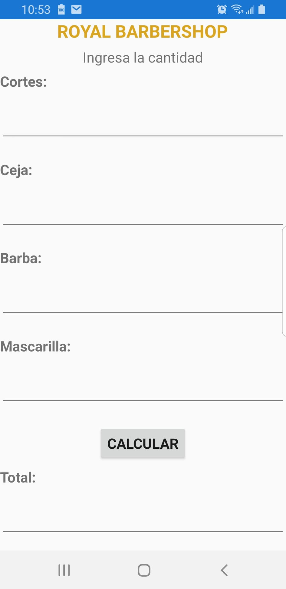

### Name
Xamarin_BarberShop

### Description
Esta aplicación es para una Barberia llamada **Royal BarberShop** que ofrece corte de cabello, de ceja, de barba y aplicación de mascarillas cada uno de estos servicios tienen un precio diferente, el objetivo de la aplicación es que el barbero(usuario) ingrese la cantidad que se realizó por cada servicio y se realicen los cálculos dependiendo de la cantidad de lo que el cliente solicitó para obtener el total de pago.

### Visuals

### Usage
Esta aplicación es para que calcule el total de los servicios que se realizó el cliente en la barberia. Los costos de los diferentes servicios que brinda son:

_-Cortes =100 pesos\
-Ceja=20 pesos\
-Barba=40 pesos\
-Mascarilla=50 pesos_

Y en la aplicación se debe de ingresar la cantidad de cada uno de los servicios que esta solicitando el cliente y si un cliente solicitó todos los servicios el total que se espera es que sea de _210 pesos_.

### Roadmap

Mejorar el diseño de la aplicación para que se vea con mejor apariencia.

### Authors and acknowledgment

Daniela Cortez Zavala responsable de la creación de este proyecto
